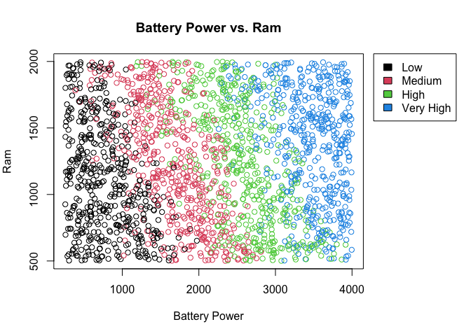
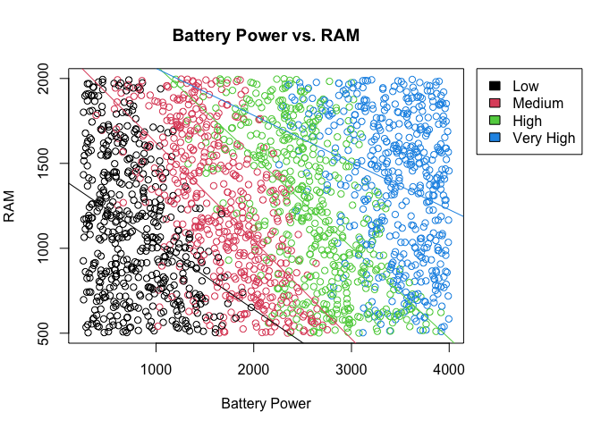
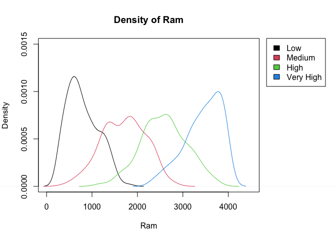
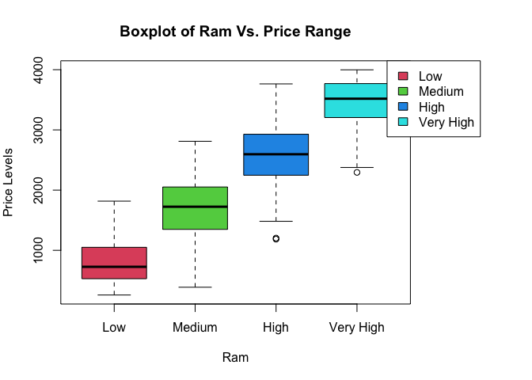
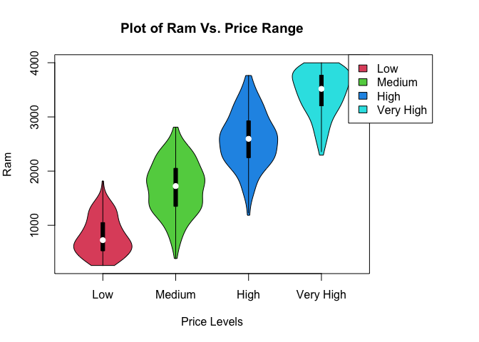
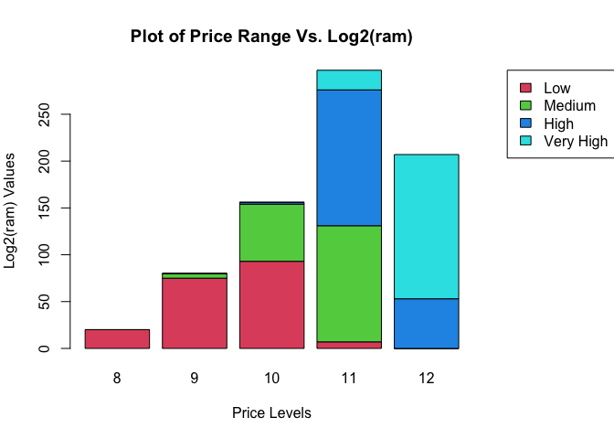

Homework 3
================
Yoshita Narang
2022-10-13

# Problem 1

``` r
# (a) 
# Turn the variable price_range into a factor variable with levels: “0” for low, “1” for
# medium, “2” for high, and “3” for very high.

# Set Working Directory 
setwd("~/Library/CloudStorage/Box-Box/Playground Learning/Mobile_Price_Dataset")

# Read the data in its original format (.csv) in to the data frame mobile_data
library(readr)
mobile_data <- read.csv("train.csv")

# Levels outlines the different numerical values present in price_range
# Labels associates each numerical level with a label to correlate the two 
mobile_data$price_range <- factor(mobile_data$price_range,
                                   levels = c(0, 1, 2, 3),
                                   labels = c("Low", "Medium", "High", "Very High"))
```

``` r
# (b)

# Make a scatter plot between the variables battery power vs ram

# Using par() function, implement multiple graphs in a single plot
par(mar = c(5, 4, 4, 8), xpd = TRUE)

plot(mobile_data$ram, mobile_data$battery_power,
     col = mobile_data$price_range,
     main = "Battery Power vs. Ram", 
     xlab = "Battery Power",
     ylab = "Ram")

legend("topright",
       inset = c(-0.3, 0),
       legend = c("Low", "Medium", "High", "Very High"),
       fill = c(1, 2, 3, 4))
```

<!-- -->

``` r
# (c)

# Use cor.test() function to run correlation test between variables
cor.test(mobile_data$battery_power, mobile_data$ram) 
```

    ## 
    ##  Pearson's product-moment correlation
    ## 
    ## data:  mobile_data$battery_power and mobile_data$ram
    ## t = -0.029185, df = 1998, p-value = 0.9767
    ## alternative hypothesis: true correlation is not equal to 0
    ## 95 percent confidence interval:
    ##  -0.04448259  0.04317924
    ## sample estimates:
    ##           cor 
    ## -0.0006529264

``` r
# Pearson Value: -0.0006529264 
# Negative value indicates a negative association between the variables 
```

``` r
# (d)

# Create 4 separate data sets by sub-setting
priceLow <- subset(mobile_data, price_range == "Low")
priceMedium <- subset(mobile_data, price_range == "Medium")
priceHigh <- subset(mobile_data, price_range == "High")
priceVeryhigh <- subset(mobile_data, price_range == "Very High")
```

``` r
# (e)
# Calculate the Pearson correlation coefficient between the variable pair (ram , 
# battery power) separately for each price range. Explain any correlations you 
# might find in terms of how a cellphone operates. Why is this result so much 
# different from the one that we found in Part c?

cor.test(priceLow$battery_power, priceLow$ram) # Pearson Value: -0.3465878 
```

    ## 
    ##  Pearson's product-moment correlation
    ## 
    ## data:  priceLow$battery_power and priceLow$ram
    ## t = -8.2455, df = 498, p-value = 1.473e-15
    ## alternative hypothesis: true correlation is not equal to 0
    ## 95 percent confidence interval:
    ##  -0.4214689 -0.2670123
    ## sample estimates:
    ##        cor 
    ## -0.3465878

``` r
cor.test(priceMedium$battery_power, priceMedium$ram) # Pearson Value: -0.6133971
```

    ## 
    ##  Pearson's product-moment correlation
    ## 
    ## data:  priceMedium$battery_power and priceMedium$ram
    ## t = -17.332, df = 498, p-value < 2.2e-16
    ## alternative hypothesis: true correlation is not equal to 0
    ## 95 percent confidence interval:
    ##  -0.6653016 -0.5555912
    ## sample estimates:
    ##        cor 
    ## -0.6133971

``` r
cor.test(priceHigh$battery_power, priceHigh$ram) # Pearson Value: -0.5874086  
```

    ## 
    ##  Pearson's product-moment correlation
    ## 
    ## data:  priceHigh$battery_power and priceHigh$ram
    ## t = -16.198, df = 498, p-value < 2.2e-16
    ## alternative hypothesis: true correlation is not equal to 0
    ## 95 percent confidence interval:
    ##  -0.6420282 -0.5268565
    ## sample estimates:
    ##        cor 
    ## -0.5874086

``` r
cor.test(priceVeryhigh$battery_power, priceVeryhigh$ram) # Pearson Value: -0.2627589 
```

    ## 
    ##  Pearson's product-moment correlation
    ## 
    ## data:  priceVeryhigh$battery_power and priceVeryhigh$ram
    ## t = -6.0772, df = 498, p-value = 2.433e-09
    ## alternative hypothesis: true correlation is not equal to 0
    ## 95 percent confidence interval:
    ##  -0.3425564 -0.1791972
    ## sample estimates:
    ##        cor 
    ## -0.2627589

``` r
# (f)
# Recreate the plot from Part b, and add the trend lines for each price range separately

# Trend Line for priceLow 
par(mar = c(5, 4, 4, 8), xpd = TRUE)

plot(mobile_data$ram, mobile_data$battery_power,
     col = mobile_data$price_range,
     main = "Battery Power vs. RAM", 
     xlab = "Battery Power",
     ylab = "RAM")

legend("topright",
       inset = c(-0.3, 0),
       legend = c("Low", "Medium", "High", "Very High"),
       fill = c(1, 2, 3, 4))

# Use of function, lm() to create a regression model with trend lines 
# Each trend line is of a color corresponding to the level associated with 
# originally
low_trend <- lm(priceLow$battery_power ~ priceLow$ram, data = priceLow)
medium_trend <- lm(priceMedium$battery_power ~ priceMedium$ram, 
                   data = priceMedium)
high_trend <- lm(priceHigh$battery_power ~ priceHigh$ram, data = priceHigh)
very_high_trend <- lm(priceVeryhigh$battery_power ~ priceVeryhigh$ram, 
                      data = priceVeryhigh)

# abline() function used to add regression lines to a graph
abline(low_trend, col = 1, xpd = FALSE)
abline(medium_trend, col = 2, xpd = FALSE)
abline(high_trend, col = 3, xpd = FALSE)
abline(very_high_trend, col = 4, xpd = FALSE)
```

<!-- --> Problem 2

``` r
# (a) 

# Subset clock speed of mobile_data, using Boolean sequence to only display 
# mobile phones that have 4, 6, & 8 in their processors 
# The variable, n_cores, holds the # of cores in the phone’s microprocessor
clock_speed <- subset(mobile_data, (mobile_data$n_cores == 4 | 
                                      mobile_data$n_cores == 6 | 
                                      mobile_data$n_cores == 8))
# Find Original Average & Median to find any changes in values 
round(mean(mobile_data$clock_speed), digits = 2) # 1.52
```

    ## [1] 1.52

``` r
round(median(mobile_data$clock_speed), digits = 2) # 1.5
```

    ## [1] 1.5

``` r
# Find New Average & Median
round(mean(clock_speed$clock_speed), digits = 2) # 1.53
```

    ## [1] 1.53

``` r
round(median(clock_speed$clock_speed), digits = 2) # 1.5
```

    ## [1] 1.5

``` r
# Since the value has increased from the original to new mean, calculate the 
# correlation, using the cor() function, to measure the closeness of association
cor(mobile_data$clock_speed, mobile_data$n_cores) # -0.005724226
```

    ## [1] -0.005724226

``` r
# The Correlation Value between n_cores & clock_speed is -0.005724226, hence why 
# the new mean has increased marginally from the original, mobile_data
# Negative correlation causes one variable to increase, while the other decreases 
```

``` r
# (b)

# Make density curves of the RAM where the 4 price ranges are in one plot 

# Subset price ranges 
# Of the clock_speed subset already initialized, we are creating a new subset to make density curves where the 4 price ranges are in one plot
LowPriceDensity <- subset(clock_speed, price_range == "Low")  
MediumPriceDensity <- subset(clock_speed, price_range == "Medium") 
HighPriceDensity <- subset(clock_speed, price_range == "High") 
VeryHighPriceDensity <- subset(clock_speed, price_range == "Very High") 


# Implement multiple graphs in single plot with the par() function
par(mar = c(5, 4, 4, 8), xpd = TRUE)

d <- density(LowPriceDensity$ram)

# Plot initial density
plot(d, main="Density of Ram",
     xlim = c(0, 4500), # Sets  x-axis limits & y-axis limits of plots
     ylim = c(0, 0.0015),
     xlab = "Ram",
     ylab = "Density",
     col = 1
     )

# Using lines() function, all four density curves are plotted in a single graph
lines(density(MediumPriceDensity$ram), col = 2)
lines(density(HighPriceDensity$ram), col = 3)
lines(density(VeryHighPriceDensity$ram), col = 4)

# Legend to differentiate colors associated with different price levels 
legend("topright",
       inset = c(-0.3, 0),
       legend = c("Low", "Medium", "High", "Very High"),
       fill = c(1, 2, 3, 4))
```

<!-- -->

``` r
# Describe the shapes respectively
# The desntiy curve shape of LowPriceDensity is skewed to the right, & unimodal
# The density curve for MediumPriceDensity has a bimodal & symmetric shape  
# HighPriceDensity has a plot shape that is symmetric, & uniform 
# The shape of VeryHighPriceDensity plot if skewed to the left & unimodal 
```

``` r
# (c) 
# Make box plots of the ram where the 4 price ranges are in one plot

# If one side of the box is longer than the other, it does not mean that side contains more data
# If the longer part of the box is above the median, the data is skewed right
# If the longer part is below the median, the data is skewed left

par(mar = c(5, 4, 4, 8), xpd = TRUE)

boxplot(clock_speed$ram ~ clock_speed$price_range,
        main = "Boxplot of Ram Vs. Price Range",
        xlab = "Ram",
        ylab = "Price Levels",
        col = (2:5))

legend("topright",
       inset = c(-0.2, 0),
       legend = c("Low", "Medium", "High", "Very High"),
       fill = c(2, 3, 4, 5))
```

<!-- -->

``` r
# For priceLow, the shape is skewed right, lacking outliers. 
# For priceMedium, the boxplot has no skew, & relatively normally distributed
# priceHigh has a plot that is relatively normally distributed with no skew
# priceVeryhigh has a plot that has outliers & is left skewed with the 
# longer part below the median
```

``` r
# (d)
# Without using ggplot2, make a violin plot of the ram where the 4 price ranges 
# are in one plot & describe their shapes respectively

# Install Vioplot package: install.packages("vioplot")
library(vioplot)
```

    ## Loading required package: sm

    ## Package 'sm', version 2.2-5.7: type help(sm) for summary information

    ## Loading required package: zoo

    ## 
    ## Attaching package: 'zoo'

    ## The following objects are masked from 'package:base':
    ## 
    ##     as.Date, as.Date.numeric

``` r
par(mar = c(5, 4, 4, 8), xpd = TRUE)
vioplot(clock_speed$ram ~ clock_speed$price_range, 
        main = "Plot of Ram Vs. Price Range",
        xlab = "Price Levels",
        ylab = "Ram",
        col = (2:5))

legend("topright",
       inset = c(-0.2, 0),
       legend = c("Low", "Medium", "High", "Very High"),
       fill = c(2, 3, 4, 5))
```

<!-- -->

``` r
# The violin plot for priceLow is skewed positively & priceMedium is relatively 
# normally distributed. The plot for priceHigh is relatively normally 
# distributed, while the violin plot for priceVeryhigh is skewed negatively. 
```

``` r
# (e)
# Make a factor variable out of ram by taking the log2(ram) & rounding that value
# to the nearest whole number. Explain why this approach makes sense
clock_ram_log <- factor(round(log2(clock_speed$ram),digits = 0))

# Print the Minimum & Maximum Values
min(log2(clock_speed$ram)) # 8.011227
```

    ## [1] 8.011227

``` r
max(log2(clock_speed$ram)) # 11.96506
```

    ## [1] 11.96506

``` r
# This approach of finding the minimum & maximum values makes sense as there is 
# a fixed set of values when taking the log2 of ram. This is because we first 
# converted the ram values into a factor variable Thus, we are to find the 
# smallest & largest values of the set to interpret, and further use those values 
# to create graphs moving forward 
```

``` r
# (f)
# Make a stacked bar plot to show the relation between price range & log2(ram)
par(mar = c(5, 4, 4, 8), xpd = TRUE)

stacked_bar_plot_log <- clock_speed$price_range

f_table <- table(stacked_bar_plot_log, clock_ram_log)
barplot(as.matrix(f_table),
        main = "Plot of Price Range Vs. Log2(ram)",
        xlab = "Price Levels",
        ylab = "Log2(ram) Values",
        col = c(2, 3, 4, 5))

legend("topright",
       inset = c(-0.35, 0),
       legend = c("Low", "Medium", "High", "Very High"),
       fill = c(2, 3, 4, 5))
```

<!-- -->
